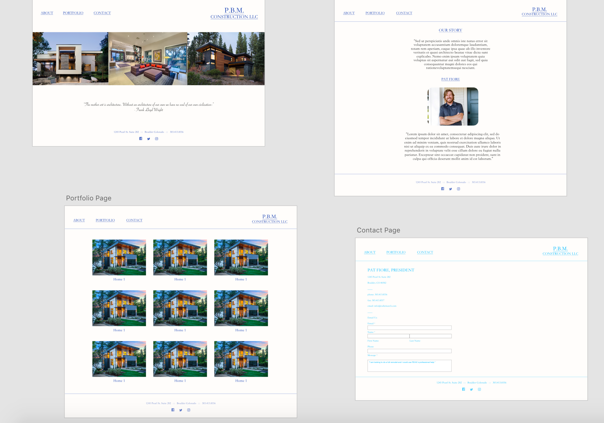

Please fork and clone this repository:

# P.B.M Construction Q1 Project

I partnered with a local Construction company to build a Web Application to maximize their outreach and credibility. Check it out!

## Wireframe

Take a look at how I went about framing the styles of what my page could look like. Although the final product ended up quite different, I used a ton of the original blueprint styling and features.

## Page Planning (Trello)

Personally I found that Trello.com worked the best for me while planning my project. It allowed me too easily write stories and give life and organization to something that could otherwise be a little scattered. Check out the link below.

https://trello.com/b/0fEo1XJ4/pbm-construction-site

More specifically, the page should allow a user to do the following.

## Responsive Design

As you can see it was very important to design this website mobile first and build to the desktop from there.

## Deployment

Check us out!
http://pbmconstruction.surge.sh/index.html
